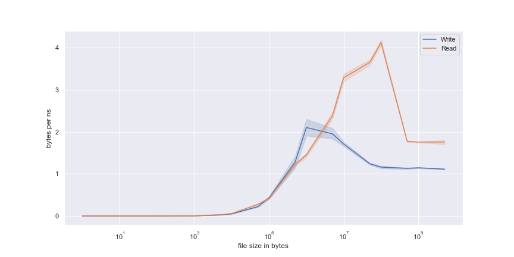

# Testing File Read/Write Speed

_created by Austin Poor_

I wanted to experiment with how long it takes to read & write files of different sizes in Python. What is the ideal size for a single file for optimized read/write times?

For example, when storing rows of data, how big should each file be to a) counteract the penalty of reading files and b) minimize the cost of rewriting files.

The above plot shows the number of bytes written per nanosecond compared to the size of file, in bytes.

